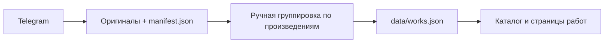

# ТЗ: каталог произведений Lili Miller

Дата: 15 июля 2026 года.

## 1. Решение

Сайт состоит из двух связанных уровней:

1. Лендинг создаёт первое впечатление, объясняет художественный метод и показывает 4–6 избранных работ.
2. Каталог раскрывает архив произведений, серии, статусы и полные истории персонажей.

Каталог не должен выглядеть интернет-магазином или автоматической копией Telegram. Его модель — цифровой каталог художника и архив для коллекционеров, галерей и кураторов.

## 2. Исходные данные

- Выгружено 250 изображений из двух Telegram-источников.
- 88 изображений получено из рабочего чата `-5265896039`.
- 162 изображения получено из канала `-1001669754520`.
- Изображения объединяются в 119 сообщений и альбомов.
- С 94 изображениями связаны подписи Telegram-постов.
- Web-индекс хранится в `data/telegram-media-manifest.json`; локальные исходники исключены из Git.
- Читаемый архив подписей хранится в `content/telegram-media-catalog.md`.

Одна работа может иметь 6–12 фотографий. Поэтому 250 файлов не равны 250 произведениям. Перед публикацией фотографии необходимо объединить в сущности «работа».

## 3. Цели каталога

- показать художественную практику шире четырёх работ лендинга;
- сохранить проданные произведения как часть профессионального архива;
- сделать серии и развитие работ понятными без просмотра Telegram;
- дать коллекционеру быстрый ответ о статусе произведения;
- дать куратору материалы, технику, год, размеры, выставочную историю и контакты;
- создать устойчивую структуру для русского и английского контента.

## 4. Пользовательские сценарии

### Коллекционер

Переходит с лендинга в каталог, выбирает доступные или выставочные работы, изучает детали и отправляет персональный запрос художнику.

### Куратор или галерея

Фильтрует работы по серии и году, открывает полную карточку, смотрит материалы, размеры, выставки и запрашивает CV или дополнительную съёмку.

### Поклонник творчества

Исследует персонажей по мирам и сериям, читает истории и переходит к связанным произведениям.

## 5. Карта сайта

- `/` — действующий лендинг.
- `/catalog.html` — каталог произведений.
- `/work.html?slug=otsuyu` — карточка произведения в MVP.
- В следующей версии: `/catalog/otsuyu/` и отдельные индексируемые страницы работ.

В верхнее меню добавляется пункт «Каталог». Ссылка «Смотреть коллекцию» на первом экране ведёт в каталог, а секция избранных работ остаётся на лендинге.

## 6. Страница каталога

### Первый экран

- заголовок «Каталог произведений»;
- короткое пояснение о фарфоровых куклах и OOAK;
- количество опубликованных произведений;
- один редакционный кадр, отличный от hero лендинга.

### Фильтры

- направление: фарфоровые BJD / малый фарфор / Teddy;
- серия: Мифы Японии / Женщины Возрождения / Жёны русских царей / Другие миры;
- год;
- статус: доступна / на выставке / частная коллекция / архив;
- поиск по имени персонажа;
- сортировка: избранное / новые / старые.

На desktop фильтры располагаются в одну строку и остаются видимыми при прокрутке. На мобильном открываются в компактной панели. Активные фильтры показываются отдельными чипами и сбрасываются одной кнопкой.

### Сетка

- асимметричная editorial-сетка, продолжающая визуальный язык лендинга;
- 3 карточки в ряд на широком экране, 2 на планшете, 1 на телефоне;
- не использовать бесконечную прокрутку в MVP;
- первая загрузка показывает 12–18 работ;
- проданные работы не скрываются и явно помечаются как «Частная коллекция».

### Карточка в сетке

- главное изображение;
- имя работы;
- год;
- серия;
- статус;
- материал или направление;
- ссылка «Смотреть историю».

Статус нельзя кодировать только цветом: он всегда отображается текстом.

## 7. Страница произведения

### Обязательные блоки

1. Имя, год, серия и статус.
2. Главное изображение.
3. Галерея из 6–12 кадров: общий план, лицо, руки, костюм, шарниры и масштаб.
4. Короткий синопсис.
5. Полный авторский рассказ.
6. Паспорт работы: материал, техника, высота, подвижность, OOAK или тираж.
7. Выставки и публикации.
8. Статус владения и CTA.
9. Связанные персонажи из той же серии.
10. Ссылка на исходную публикацию Telegram, если она публична.

### CTA по статусу

- доступна: «Узнать о приобретении»;
- на выставке: «Узнать выставочный маршрут»;
- частная коллекция: «Запросить похожую работу» или только нейтральный контакт;
- архив: «Обсудить сотрудничество».

Цены, корзина и онлайн-оплата в MVP не нужны.

## 8. Категории первого релиза

### Фарфоровые персонажи

- Оцую;
- Лукреция Борджиа;
- Катерина Сфорца;
- Контессина де Барди;
- Кицунэ;
- Спящий демон;
- Следуй за белым кроликом.

### Жёны русских царей

- Княгиня Ольга;
- Елена Глинская;
- Мария Григорьевна Годунова.

### Дополнительные направления

- один объединённый проект малого фарфора;
- одна или две карточки Teddy, визуально отделённые от фарфоровых BJD.

Рекомендуемый MVP: 12 полноценных карточек. После подтверждения данных каталог можно расширить до 18 работ без изменения интерфейса.

## 9. Модель данных

Публичный каталог получает отдельный файл `data/works.json`. Telegram-манифест не используется напрямую в интерфейсе: он содержит технический архив, повторы и неподтверждённые данные.

```json
{
  "id": "otsuyu",
  "slug": "otsuyu",
  "title": { "ru": "Оцую", "en": "Otsuyu" },
  "year": "2025–2026",
  "direction": "porcelain-bjd",
  "series": "myths-of-japan",
  "status": "exhibition",
  "material": { "ru": "Фарфор", "en": "Porcelain" },
  "dimensions": null,
  "hero": "assets/images/telegram-web/lilimillerdoll/231.webp",
  "gallery": [
    "assets/images/telegram-web/lilimillerdoll/231.webp",
    "assets/images/telegram-web/lilimillerdoll/232.webp"
  ],
  "story": { "ru": "...", "en": "..." },
  "sourcePosts": ["https://t.me/lilimillerdoll/231"],
  "featured": true,
  "sortOrder": 10
}
```

### Обязательные поля

- `id`, `slug`;
- `title.ru`, `title.en`;
- `year`;
- `direction`;
- `series`;
- `status`;
- `hero`, `gallery`;
- короткий текст и полный рассказ;
- источники данных;
- `featured`, `sortOrder`.

### Поля, требующие подтверждения художника

- материал и техника;
- размеры;
- точный год;
- статус и доступность;
- OOAK или тираж;
- выставки;
- наличие сертификата;
- английское название и перевод истории.

## 10. Контентный процесс



1. Экспортёр обновляет изображения, подписи и ссылки на публикации.
2. Редактор выбирает лучшие фотографии и связывает их с произведением.
3. Подтверждённые данные попадают в `works.json`.
4. Каталог отображает только подтверждённые произведения.

Новые Telegram-публикации не должны автоматически становиться публичными карточками.

## 11. Изображения и производительность

Оригиналы остаются архивом. Для сайта создаются производные версии:

- карточка: AVIF/WebP шириной 640 и 960 px;
- hero: AVIF/WebP шириной 1600 и 2200 px;
- миниатюра галереи: 320–480 px;
- JPEG используется как fallback;
- у всех изображений фиксируются `width` и `height`;
- всё ниже первого экрана загружается лениво;
- одна карточка не должна загружать всю галерею до открытия.

Цель: первая полезная отрисовка каталога до 2,5 секунды на мобильном 4G, без полноэкранной заставки.

## 12. Доступность и SEO

- управление фильтрами и галереей с клавиатуры;
- видимый фокус;
- содержательные alt-тексты;
- заголовок H1 только один на страницу;
- уникальные title и description для каждой работы;
- русская и английская версии;
- Open Graph-изображение для произведения;
- структурированные данные `VisualArtwork` после перехода на отдельные URL.

## 13. Аналитика

Минимальные события:

- открытие каталога;
- применение фильтра;
- открытие карточки;
- просмотр галереи;
- нажатие CTA;
- переход к исходной публикации Telegram.

## 14. Этапы реализации

### Этап 0 — подготовка контента

- подтвердить список 12 работ;
- объединить фотографии по произведениям;
- подтвердить материалы, размеры и статусы;
- выбрать hero и 5–10 дополнительных кадров;
- подготовить короткие и полные тексты.

### Этап 1 — MVP каталога

- создать `catalog.html`;
- создать `data/works.json`;
- добавить фильтры и поиск;
- реализовать сетку и динамическую карточку работы;
- связать каталог с лендингом;
- проверить desktop и mobile.

### Этап 2 — полноценный архив

- отдельные URL произведений;
- английская версия;
- SEO и Open Graph;
- выставки, публикации и связанные произведения;
- оптимизированные форматы изображений.

### Этап 3 — сценарии коллекционеров

- доступные произведения;
- форма персонального запроса;
- подписка на новые работы;
- PDF-каталог для кураторов и галерей.

## 15. Критерии готовности MVP

- пункт «Каталог» доступен с каждой страницы;
- опубликовано не менее 12 произведений;
- фотографии сгруппированы по произведениям, а не показаны сырой Telegram-лентой;
- работают поиск, серия, направление, год и статус;
- активные фильтры сохраняются в URL;
- карточка содержит галерею, историю, паспорт и CTA;
- проданные работы остаются в архиве;
- мобильная версия работает от 360 px;
- отсутствуют битые изображения и неподтверждённые факты;
- сайт остаётся доступным без JavaScript на уровне базового списка работ либо показывает понятное сообщение.

## 16. Решения, которые нужно утвердить

1. Публикуем каталог только фарфоровых работ или включаем Teddy отдельным направлением.
2. Показываем ли статус «Доступна» публично или только по запросу.
3. Нужны ли цены; рекомендация для MVP — не показывать.
4. Куда ведёт CTA: Telegram, email или форма на сайте.
5. Кто подтверждает материал, размеры, год и статус каждой работы.
